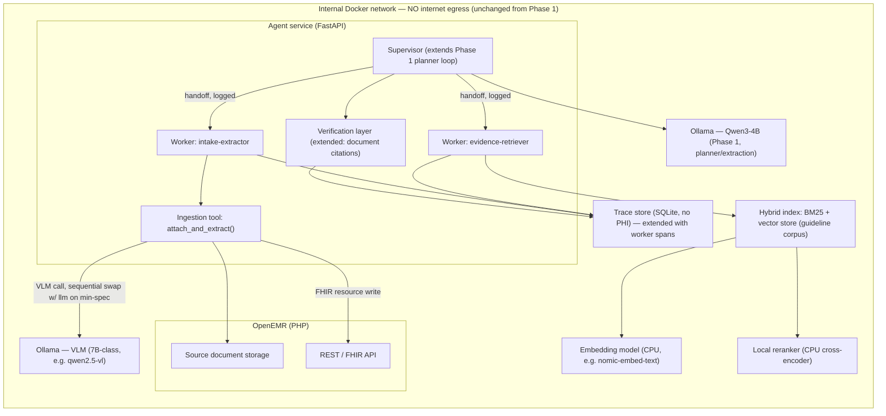
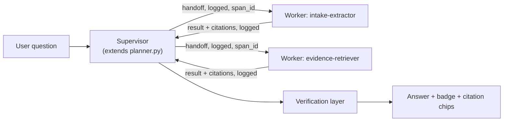

# Clinical Co-Pilot — Week 2 (Phase 2) Architecture

- **Status:** Draft (P2.1). Phase 2 is mid-build; this document sets the
  target architecture, schemas, SLOs, and operational posture that the rest
  of Phase 2 (Stages 3–6) builds toward. Where a number is measured, its
  source is the Phase 1 capacity run (`docs/ARCHITECTURE.md` §"Capacity
  reality"); where it is a target set in advance of Phase 2's own
  measurement, it is marked "to be validated in P3G.4 perf baselines."
- **Related:** `docs/ARCHITECTURE.md` (Phase 1 / Week-1 architecture, frozen
  at v1.0 — this document extends it, does not replace it),
  `planning/PLAN.md` (frozen Phase 2 plan), `docs/USERS.md` (persona and
  UC1–UC5 use cases every capability below traces to), `docs/TEST_PLAN.md`
  (eval methodology, PR Definition of Done).

## Summary

Phase 1 shipped a verification-first co-pilot that answers questions against
*structured* OpenEMR data — medications, labs, encounters — with every claim
independently re-checked against the raw record. Phase 2's job is to extend
that same trust story to *unstructured source documents*: a scanned lab
report or an intake form a patient hands over on paper. The architectural
bet carried forward unchanged is that a small model plus deterministic
verification beats a bigger model you trust blindly; Phase 2's addition is
that the same discipline — schema-constrained extraction, "not found" over
fabrication, and a citation that a deterministic checker can re-validate —
has to hold for *vision* extraction from a PDF, not just for text-shaped
tool output.

Two new capabilities sit on top of the Phase 1 core. First, **document
ingestion**: a local vision-language model (VLM) extracts structured facts
(lab results, intake demographics) from an uploaded PDF, stores the source
document in OpenEMR, and persists the derived facts as FHIR resources — with
a citation contract that points back to the exact page/section and quoted
value, so a clinician can click a claim and see the source pixels. Second,
**hybrid retrieval-augmented answering**: a small, public, non-PHI
clinical-guideline corpus is indexed with sparse (BM25) and dense
(embedding) retrieval, reranked locally, so the agent can answer
guideline-grounded questions ("is this within reference range for her age?")
without ever calling out to a cloud model or a cloud search API.

Both capabilities run fully local, on the same zero-egress Docker network
Phase 1 established — the VLM, embedding model, and reranker are additional
Ollama-served (or in-process) models on the same box, not a new trust
boundary. The two are wired together, and to the existing single-tool-planner
core, by a small in-house **supervisor** that hands work to two workers
(intake-extractor, evidence-retriever) with explicit, logged handoffs —
extending Phase 1's correlation-id tracing rather than introducing a new
orchestration framework.

## Architecture Diagram



This extends, not replaces, the Phase 1 diagram in `docs/ARCHITECTURE.md`
(agent internals, Ollama boundary, network egress posture, dev token bridge)
— those trust boundaries are unchanged by Phase 2 and are not repeated here.

## 1. Week-1 Baseline vs Week-2 New

| Capability | Week-1 (v1.0, inherited) | Week-2 (Phase 2, this document) |
|---|---|---|
| Data source | Structured OpenEMR data via typed tools (meds, labs, encounters, vitals) | + Unstructured source documents (lab PDF, intake form) via vision extraction |
| Retrieval | None — planner calls typed tools directly | + Hybrid RAG (BM25 + dense) with local rerank over a public guideline corpus |
| Orchestration | Single planner loop, one tool call per turn | + Supervisor delegating to 2 workers (intake-extractor, evidence-retriever), explicit logged handoffs |
| Citation contract | `{tool_call_id, record_id, field, asserted_value}` against cached tool output | + `{source_type, source_id, page_or_section, field_or_chunk_id, quote_or_value}` against source documents, with a visual PDF bounding-box overlay |
| Verification | Deterministic re-check against raw structured tool results | + Extended to re-check document-sourced claims against extracted facts; same fail-closed "not found" discipline for unreadable/absent fields |
| Eval gate | 31-case suite, category pass/fail, 0.8065 pass rate | + 50-case golden set, boolean rubrics (`schema_valid`, `citation_present`, `factually_consistent`, `safe_refusal`, `no_phi_in_logs`), PR-blocking CI gate |
| Observability | Correlation IDs, request/verdict-level trace store | + Per-encounter cost/latency breakdown (tool sequence, per-step latency, token usage, retrieval hits, extraction confidence), worker spans as children of the supervisor span |
| Models served | Qwen3-4B (planner, quarantine, extraction) | + 7B-class VLM (document extraction), embedding model, reranker — all local |
| Access control | Per-user OAuth2/PKCE/SMART built, proven live, flag-gated OFF | Unchanged — same flag, same posture (see §8) |

## 2. Phase 1 Debt Disposition

Carried forward from the Phase 1 freeze checklist (`planning/PLAN.md` §"Phase
1 freeze status"). None of these block Phase 2; each is a deliberate,
disclosed deferral:

| Item | What it is | Why deferred | When addressed |
|---|---|---|---|
| CORS TODO (`src/RestControllers/Subscriber/CORSListener.php:56-57`) | `onKernelResponse` echoes the request's `Origin` header back verbatim into `Access-Control-Allow-Origin` rather than checking it against an allowlist, with an inline `@TODO: review security implications if we need to tighten this up` | Inherited OpenEMR base behavior, needed as-is to keep public API clients (SMART apps, third-party integrations) working; tightening it is a base-platform change orthogonal to the Co-Pilot's own scope | Base-platform hardening, not scheduled within Phase 2 or Phase 3 — tracked as an OpenEMR-base concern, revisit if/when the base project addresses it upstream |
| `#185` async token introspection | `introspect_token`'s sync `httpx` call briefly occupies the FastAPI event loop when the per-user OAuth flag is on and the introspection cache misses | Low urgency: cached after first hit, and Phase 1's own capacity run showed the workload is GPU-inference-bound (~0.15 req/s), so a few-ms loop stall is negligible in practice | Before the per-user flag is ever flipped ON by default (see §8) — not required for Phase 2's document/RAG work, which doesn't touch this code path |
| `#172` input-side PHI deterrent | Guidance/placeholder text on the feedback-comment field so clinicians aren't tempted to type patient identifiers into a 👎 comment (defense-in-depth on top of the existing export-side scrub from `#157`) | Non-urgent: local-first, trusted-network deployment keeps the residual risk low, and the export-side scrub already closes the public-repo leak surface | Opportunistic UI follow-up; not a Phase 2 dependency since Phase 2 introduces its own no-PHI-in-logs CI check (§4, §Stage 3 gate) covering the new ingestion/retrieval surface directly |
| `#175` encounter-planner tool-selection | For a "what's going on with her right now" question over a patient with only a stale encounter (no problems/vitals), the planner never calls `get_encounters`, so the Phase 1 recency-notice mechanism has nothing to attach to; kept as an honest `xfail` | Root cause is a 4B-model tool-selection weakness, not a code defect — fixing it needs prompt work plus live re-recording with uncertain payoff on this model tier | Revisit if Phase 2's supervisor/worker split changes the planner's tool-selection prompting anyway; otherwise stays a documented, measured `xfail` per its own acceptance criteria |
| P5.6 fresh-clone validation | Confirm the stack runs end-to-end from a fresh clone using README instructions alone, no undocumented steps | N/A — already resolved | **Closed** at Phase 1 freeze; Phase 2 inherits a validated fresh-clone baseline and must keep it green as new services (VLM, embeddings, reranker, hybrid index) are added to the compose stack |

## 3. Schemas

### 3.1 Extraction schemas

Both extraction targets follow the Phase 1 pattern established by
`ollama_client.extract` (schema-constrained decoding into Pydantic) — the
VLM's output is never accepted as free text, only as a validated instance
of one of these models. Any field the model cannot read from the document
is `None` ("not found"), never guessed; this is the extraction-side
equivalent of Phase 1's citation-checker fail-closed discipline.

```python
class Citation(BaseModel):
    source_type: Literal["lab_pdf", "intake_form"]
    source_id: str            # stored source-document identifier
    page_or_section: str      # e.g. "page 2" or "Section: Medications"
    field_or_chunk_id: str    # which extracted field this citation backs
    quote_or_value: str       # the literal text/value the model read


class LabResultFact(BaseModel):
    test: str
    value: str | None
    unit: str | None
    reference_range: str | None
    collection_date: str | None   # ISO date if legible, else None
    abnormal_flag: Literal["H", "L", "A", "N"] | None
    citation: Citation


class IntakeFormFact(BaseModel):
    demographics: dict[str, str | None]   # name, dob, sex — as legible
    chief_concern: str | None
    medications: list[str]
    allergies: list[str]
    family_history: list[str]
    citation: Citation
```

### 3.2 Citation contract

Every clinical claim sourced from a Week-2 document — not just the raw
extraction, but any answer the agent later builds on top of it — carries the
same shape:

```python
class DocumentCitation(BaseModel):
    source_type: Literal["lab_pdf", "intake_form"]
    source_id: str
    page_or_section: str
    field_or_chunk_id: str
    quote_or_value: str
```

This is the document-sourced counterpart to Phase 1's
`{tool_call_id, record_id, field, asserted_value}` structured-data citation
(`docs/ARCHITECTURE.md` §"Verification Design"). The Phase 1 verification
layer (`verification.py`) is extended, not replaced: it builds its
`(tool_call_id, record_id, field) -> value` index for structured tool
results exactly as before, and gains a parallel index keyed on
`(source_id, field_or_chunk_id) -> quote_or_value` for document facts. A
claim citing a document field is verified the same way — normalized
equality against the extracted (not re-inferred) value — so the "partial
grounding is not grounding" rule applies identically to both citation
shapes.

### 3.3 Migration notes

No changes are expected to any Week-1 (Phase 1) database table or schema.
Week-2 artifacts are additive:

- **Source documents** (the uploaded lab PDF / intake form) are stored in
  OpenEMR's own document-management facilities, not a new Co-Pilot-owned
  table — Phase 2 deliberately does not duplicate OpenEMR's document store.
- **Extracted facts** are persisted as standard FHIR resources
  (`Observation` for lab results, `Patient`/`Condition`/`AllergyIntolerance`
  -shaped data for intake facts) through OpenEMR's existing REST/FHIR API,
  the same system of record Phase 1's tools already read from — Phase 2
  writes through it rather than around it, consistent with Phase 1's "the
  Co-Pilot owns none of the system of record" design principle.
- The hybrid-RAG guideline corpus and its BM25/vector index are a new,
  separate, non-PHI store (public documents only) and carry no migration
  concern for existing patient data.

## 4. Testing Strategy

Follows `docs/TEST_PLAN.md`'s red-first discipline, extended per code type:

- **Unit tests** — schema validation (malformed/partial VLM output coerces
  to `None` fields, never raises or fabricates), citation-index construction
  for the new document-keyed index, supervisor→worker handoff event
  emission. Fast, no model calls, no database.
- **Integration tests** — `attach_and_extract()` end-to-end against fixture
  PDFs (including at least one deliberately low-quality/unreadable scan, to
  prove the "not found" path), hybrid retrieval against a small fixture
  corpus, worker spans correctly parented under the supervisor span in the
  trace store.
- **Eval gate (CI-blocking)** — the 50-case golden set (§Stage 3 gate in
  `planning/PLAN.md`) with boolean rubrics (`schema_valid`,
  `citation_present`, `factually_consistent`, `safe_refusal`,
  `no_phi_in_logs`), extending Phase 1's `evals/` harness and assertion
  vocabulary rather than starting a parallel one.
- **Record/replay for model inference — never live in CI.** Exactly as
  Phase 1 established with `ollama_replay.py` for the planner/extraction
  LLM: VLM extraction calls and reranker scoring are recorded once against
  the real local models and replayed deterministically in CI. No CI run
  ever depends on a live Ollama call — this keeps the gate fast, offline,
  and reproducible from the repo alone.
- **Red-first per code type** (`docs/TEST_PLAN.md` §1): a failing PHPUnit
  case for any OpenEMR-side document storage change, a failing pytest case
  for any agent-side extraction/retrieval/verification change, a failing
  eval case for any new golden-set category, committed before the
  implementation that makes it pass.

## 5. SLOs

Two targets, both explicitly provisional — set from Phase 1's measured
hardware ceiling and stated engineering judgment, not from Phase 2's own
measurement, which is P3G.4's job:

- **p95 ingestion latency for a 2-page lab PDF, minimum spec: ≤ 45 seconds.
  To be validated in P3G.4 perf baselines.** Justification: Phase 1's P5.1
  capacity run measured a single-request Qwen3-4B chat turn at 10.3s on
  this exact hardware (RTX 5060 Laptop, 8GB VRAM). A document-ingestion
  request additionally requires (a) an Ollama model swap from the resident
  LLM to the VLM — sequential load/unload on an 8GB card, not concurrent
  residency, per the minimum-spec operating mode in §6 — which is the
  dominant new cost and is budgeted generously at 10-20s given no measured
  swap time yet exists for this hardware/model pair; (b) VLM decode over a
  7B-class model, budgeted at roughly 2x a 4B call's latency for a
  same-length structured extraction (~15-20s); (c) a second swap back if the
  same turn also needs the planner/extraction LLM. 45s keeps headroom over
  the sum of these budgeted pieces while remaining inside the "a clinician
  can wait for one document to process" range this use case implies (a
  one-time per-encounter action, not a per-question latency like UC1-UC4).
- **Retrieval hit-rate for the golden queries: ≥ 80% top-5 relevant-chunk
  recall on the guideline corpus. To be validated in P3G.4 perf baselines.**
  Justification: the corpus is deliberately small and curated to the
  co-pilot's actual use cases (not general-web-scale retrieval), so a
  well-tuned hybrid BM25+dense+rerank pipeline over a few dozen documents
  should comfortably clear the bar a much larger, noisier corpus would
  struggle with; 80% is set as a defensible floor rather than an
  aspirational ceiling, leaving room to raise it once P3G.4 has real
  numbers rather than picking a number the corpus's actual size can't yet
  justify.

Both numbers are targets to build toward and gate against in P3G.4, not
measurements — consistent with how Phase 1 stated its own capacity
expectations as "research-informed priors, to be measured in Phase 5"
(`docs/ARCHITECTURE.md` §"Capacity reality") before that run actually
happened.

## 6. Reference Hardware & Model Tiers

Two tiers, kept strictly separate — measured numbers are never blended with
projected ones:

| | Minimum spec (dev machine — all measured numbers) | Recommended spec |
|---|---|---|
| GPU | RTX 5060 Laptop, 8GB VRAM | Single 24-48GB+ card |
| RAM | 32GB | (not constraining at this tier) |
| Model residency | **Sequential VLM⇄LLM swap** — the VLM and Qwen3-4B are not resident simultaneously; embeddings and the reranker run on CPU to leave the full 8GB for whichever inference model is currently loaded | **All models resident simultaneously** — VLM, planner/extraction LLM, embeddings, and reranker all on-GPU, no swap latency |
| VLM tier | 7B-class (e.g. `qwen2.5-vl:7b`) | Larger VLM (model swapped in as a config value, not a code change) |
| Numbers | Measured, on this exact hardware (Phase 1's P5.1 run; Phase 2's own ingestion numbers per §5, pending P3G.4) | Projections only — no recommended-tier hardware exists in this project; stated as directional, never presented as measured |

**Model tiering is a config value, not a code fork.** The same extraction
code, the same Pydantic schemas (§3), and the same no-fabrication contract
("not found" over guessing) apply regardless of which VLM is configured —
swapping in a larger recommended-tier model changes extraction quality and
latency, not the safety invariant the verification layer depends on. This
mirrors Phase 1's own local-inference philosophy: the trust story lives in
the deterministic verification layer, not in betting on a particular
model's reliability.

## 7. Orchestration

Phase 2 extends Phase 1's hand-rolled planner loop into a **supervisor**
that delegates to two workers — **intake-extractor** (drives
`attach_and_extract()` and the VLM) and **evidence-retriever** (drives
hybrid RAG) — rather than adopting a third-party graph-orchestration
framework. This is an owner decision, not a default: `planning/PLAN.md`
and issue P3.5 name extending the custom loop as the primary path, with
LangGraph as a documented fallback only if handoff/trace requirements
prove unwieldy in practice — that fallback decision point is P3.5.

### Why not LangGraph

- **Smaller supply-chain surface.** Zero third-party orchestration
  dependencies means one fewer package (and its transitive dependency
  tree) to vet for a hospital security review, and one fewer thing for
  Phase 3's red-team to have to reason about as an attack surface. The
  in-house supervisor is a few hundred lines the team wrote and can
  fully audit; a graph-orchestration library is not.
- **Fully auditable.** Phase 1's entire trust story rests on being able to
  point at deterministic, inspectable code for every safety-critical path
  (quarantine, verification, patient binding). A hand-rolled supervisor
  keeps handoffs, span parenting, and control flow in that same
  fully-owned, fully-readable code, rather than inside a framework's
  internal state machine.
- **Consistency with the Phase 1 philosophy.** `planner.py`,
  `quarantine.py`, and `verification.py` are already a deliberately
  dependency-light, hand-rolled core; introducing a heavyweight
  orchestration framework for Phase 2 alone would fragment that
  architecture rather than extend it.

LangGraph remains the documented fallback if the custom supervisor/worker
split proves unwieldy — that reassessment is P3.5's explicit decision
point, not a decision this document forecloses.

### Handoff diagram



Every handoff is a logged event carrying a correlation id and a span id;
worker spans are recorded as **children of the supervisor span**, extending
Phase 1's correlation-id tracing (`correlation.py`) rather than introducing
a parallel tracing scheme. A live run's trace therefore shows the full
supervisor→worker→supervisor chain end-to-end from a single correlation id,
the same way Phase 1's trace store already reconstructs a full conversation
from logs alone.

## 8. Data Model, Lineage, and Access Control

### Lineage

```
source PDF page  →  extracted field (VLM, schema-constrained)  →  FHIR resource (OpenEMR)  →  cited claim (agent answer)
```

Each arrow is independently inspectable: the source document is stored
in OpenEMR and addressable by `source_id`; the extracted field carries a
`Citation` (§3.1) pointing back to the exact page/section and quoted text;
the FHIR resource write carries the same field identifiers through to
OpenEMR's system of record; and any later claim built from that resource
carries a `DocumentCitation` (§3.2) that the verification layer re-checks
against the extracted value, not a re-inference. A clinician can therefore
click any citation chip and trace it all the way back to the source pixels
on the original page.

### Access control posture

Unchanged from Phase 1, restated here because it governs Week-2 artifacts
too: the full per-user OAuth2 `authorization_code` + PKCE + SMART-launch +
introspection flow is **built and proven live end-to-end**
(`docs/ARCHITECTURE.md` §"Trust Boundaries" boundary 3, issue #124) — a
restricted role gets 403 where an admin gets 200 on the identical endpoint.
It ships **flag-gated OFF** (`copilot_per_user_token_enabled`), a deliberate
owner choice to avoid a one-way door and a consent-step demo friction, with
the shared dev-token-bridge identity as the default. Week-2's ingestion and
retrieval tools call the same `OpenEmrClient` under the same flag, so they
inherit this posture unchanged — no new ACL surface, no new flag. Flipping
`copilot_per_user_token_enabled` ON is the **first item in Path to
Production** (§11), exactly as it was in Phase 1.

## 9. Incident Response & Backup/Recovery

The deployment model is a single local appliance (Phase 1's "run where the
data lives" thesis, unchanged) — RPO/RTO are set for a single-node
appliance, not a multi-region service:

- **RPO: last nightly volume snapshot.** Justification: this is a
  single-developer/single-clinician appliance, not a multi-user production
  system with continuous write load from many concurrent users — a nightly
  snapshot bounds worst-case data loss to one day's uploaded documents and
  extracted facts, which is an acceptable trade for the operational
  simplicity of not running continuous replication on a laptop-class
  device.
- **RTO: time to `docker compose up` plus volume restore.** Justification:
  recovery is deliberately simple by design — no multi-node failover to
  coordinate, no external dependency to re-provision (everything, including
  the VLM/embedding/reranker models, is a local volume) — so RTO is bounded
  by container startup time plus however long the snapshot restore itself
  takes, typically minutes, not the hours a distributed system's failover
  choreography would need.
- **What gets backed up:** the OpenEMR MySQL volume (patient records, FHIR
  resources, uploaded source documents), the Ollama models volume
  (`ollamamodels` — LLM, VLM, embedding model weights, so a restore doesn't
  require re-downloading gigabytes of model weights), and the guideline
  corpus's hybrid index (small, non-PHI, but backed up for continuity
  rather than requiring a rebuild).
- **Degraded modes.** Extends Phase 1's existing `/health` vs `/ready`
  distinction (`docs/ARCHITECTURE.md` §"Structurally, the system has five
  pieces"): `/health` reports the FastAPI process is up; `/ready` reports
  whether the process can actually serve a request end-to-end. Phase 2
  extends `/ready`'s checks to the new models — if Ollama is unreachable,
  or the configured VLM/embedding/reranker model isn't loaded, `/ready`
  reports not-ready for the affected capability (document ingestion,
  retrieval) while structured-data chat (Phase 1's core capability) can
  continue to report ready independently, so a VLM outage degrades
  gracefully rather than taking down the whole agent.

## 10. TCO

Extends Phase 1's TCO approach (`docs/ARCHITECTURE.md` §"TCO") with the
Week-2 hardware and volume dimension: **one dedicated on-prem GPU card vs a
recurring cloud vision/OCR API**, at a plausible hospital document volume.
Kept rough and honest, consistent with Phase 1's framing — these are
estimates with a stated basis, not bills.

- **Local (one-time + amortized).** A dedicated on-prem GPU sized to the
  recommended tier (§6, 24-48GB+, all models resident) is a one-time
  hardware cost, amortized over its useful life exactly as Phase 1's TCO
  section amortized the dev laptop — no per-document API fee, no
  per-page-processed billing, and the same zero-egress property (no PHI
  ever leaves the appliance to reach a cloud vision API) that made Phase
  1's local-inference thesis attractive in the first place.
- **Cloud comparison.** A recurring cloud document/vision API (e.g. a
  commercial OCR-plus-extraction service) typically bills per page or per
  document processed. At a plausible hospital volume — say, a few hundred
  lab reports and intake forms per day across a clinic — that recurring
  per-page cost compounds continuously, the same way Phase 1's TCO section
  found for cloud LLM tokens: the gap widens linearly with volume, and the
  local GPU's fixed cost is recovered faster the higher the document
  volume, exactly mirroring Phase 1's "weeks to a few months" break-even
  framing for the LLM side.
- **Honest caveat.** Unlike Phase 1's LLM-token estimate (which had a
  measured token-size basis from prompt templates), Phase 2 has no measured
  per-document extraction cost yet — this section is a first-principles
  estimate pending Phase 2's own cost-per-encounter instrumentation
  (`planning/PLAN.md` Stage 3e), which is a Phase 2 requirement precisely
  because Phase 1's cost tracking was never wired into `/chat` either. Once
  that instrumentation lands, this section should be revisited with
  measured per-document token/latency figures rather than the estimate
  above.

## 11. Path to Production

Mirrors Phase 1's Path-to-Production structure (`docs/ARCHITECTURE.md`
§"Path to Production"), reordered so the highest-narrative-weight item leads:

1. **Flip `copilot_per_user_token_enabled` ON.** The real per-user
   OAuth2/PKCE/SMART/introspection flow is built and proven live end-to-end
   (§8) — the same flag Phase 1 left OFF by deliberate owner choice.
   Week-2's ingestion and retrieval tools inherit this flag unchanged, so
   flipping it covers Week-1 and Week-2 surfaces in one step. This is the
   single highest-leverage production-readiness item and is listed first
   for that reason, exactly as in Phase 1.
2. **TLS everywhere.** Today's internal Docker network traffic (including
   the new VLM/embedding/reranker calls) is unencrypted, acceptable only
   because it never leaves a single host; a real deployment needs TLS
   termination in front of every hop.
3. **Secrets automation.** Model-serving and OpenEMR credentials move from
   local config/`.env` to a managed secrets store as part of any real
   deployment, rather than remaining developer-machine conventions.
4. **Backup automation.** The nightly-snapshot RPO in §9 is a manual/cron
   convention today; production hardening turns it into an automated,
   monitored, tested restore procedure rather than an assumed cron job.
5. **Monitoring.** Extend the existing hand-rolled trace-store dashboard
   (Phase 1) with the new Week-2 signals called out in `planning/PLAN.md`
   Stage 3e and Stage 3 gate: extraction-failure rate, retrieval latency,
   and eval-regression alerting (>5% category regression), plus BAA-covered
   hosting, VPC, and HA exactly as Phase 1's own §4 Path-to-Production item
   describes for a real multi-node deployment.

## Use-Case Traceability

Every Week-2 capability above traces to `docs/USERS.md`'s UC1-UC5:

- **Document ingestion (§1, §3)** — extends UC1 (pre-visit brief: "what
  changed since I last saw her" can now include a just-uploaded lab PDF)
  and UC3 (lab trend recall: a scanned report's values become queryable
  the same way structured lab-tool data already is).
- **Hybrid RAG over the guideline corpus (§1, §7)** — supports UC2
  (medication safety: guideline-grounded context alongside the existing
  allergy/interaction check) without adding a new device or workflow step.
- **Citation contract + PDF overlay (§3.2, §8)** — extends the trust
  mechanism UC1-UC4 already depend on (every Phase 1 answer is citable) to
  document-sourced claims, so the "verified, before the door opens"
  standard from `docs/USERS.md`'s persona section holds for the new source
  type too.
- **Supervisor/worker orchestration (§7)** — infrastructure supporting all
  of the above; no user-facing behavior change on its own, but the logged
  handoffs are what let UC1's "answer spans encounters, labs, meds, and
  notes" synthesis now also span uploaded documents coherently.
